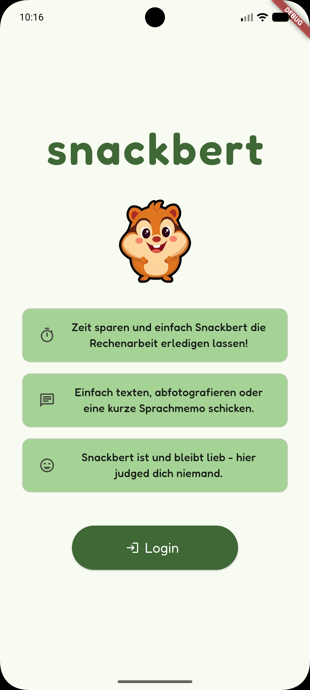
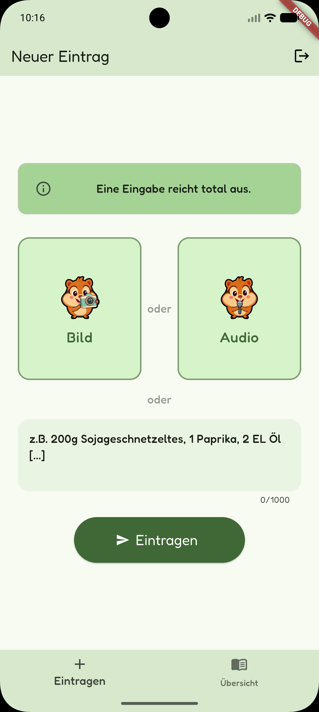
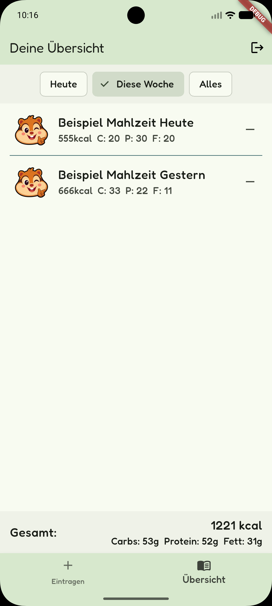

# snackbert

Snackbert is a playful nutrition tracker that turns meal logging into a fast, low-friction flow.

## Screenshots

## What the app does

- Log meals by text, photo, or short voice memo.
- Get a quick AI-driven meal analysis experience with a friendly mascot-led interface.
- Review your entries in a clean overview with filters, calories, and macro totals.
- Get reassurance from a helpful mascot rather than stressful alerts about nutrition limitations.

## Why

Snackbert is built to feel polished without being heavy. It shows practical Flutter work across UI composition, state management, media input, and a cohesive branded experience.

As a developer, I focus on products that are easy to use, visually memorable, and built around real user behavior instead of generic templates.

## Tech stack

- Flutter
- Riverpod
- Firebase services
- Image and audio input support
- Custom branded UI with reusable widgets

## In short

Snackbert is a compact example of the kind of app I like building: friendly, focused, and designed to make a boring task feel effortless.

## Setup

1. Install Flutter and run `flutter doctor`.
2. Fetch dependencies with `flutter pub get`.
3. Run the app with `flutter run`.

## AI Disclaimer

Snackbert Mascot Assets have been created using generative AI (Nano Banana 2).
